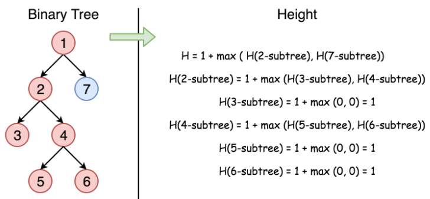

## Task 10：[104. Maximum Depth of Binary Tree](https://leetcode-cn.com/problems/maximum-depth-of-binary-tree/)

### 题目

Given a binary tree, find its maximum depth.

The maximum depth is the number of nodes along the longest path from the root node down to the farthest leaf node.

Note: A leaf is a node with no children.

```java
Example:
Given binary tree [3,9,20,null,null,15,7],

    3
   / \
  9  20
    /  \
   15   7
return its depth = 3.
```
### 思路

&emsp;&emsp;层次遍历树的节点，在遍历的同时设置layer参数统计高度，直到遍历完成。

实现关键：我怎么知到某一层的节点已经全部遍历完了？？

#### **法一：层次遍历**

对于如何判断某层的节点已经遍历完的情况：首先考虑到层次遍历的两个操作，即出队和入队操作。出队操作的是第i层的节点，而入队操作的是第i+1层的节点，因此，可以设置两个变量preCount和pCount分别来统计上一层节点和这一层节点的数目。出队时preCount--，当值为0时，层数（也即深度）level++，同时把pCount赋给preCount，pCount至0，代码如下：

```java
class Solution {
    public int maxDepth(TreeNode root) {
        Queue<TreeNode> q = new LinkedList();//因为是树节点，内存未必连续，所以用LinkdedList
        q.offer(root);
        int preCount = 1;
        int pCount = 0;
        int level = 1;
        while(!q.isEmpty()){
            TreeNode tmp = qu.poll(); //出队
            preCount --;
            if(tmp.left != null){
                q.offer(tmp.left);
                pCount++;
            }
            if(tmp.right != null){
                q.add(tmp.right);
        		pCount++;
            }
            if(preCount == 0){
                level ++;
                preCount = pCount;
                pCount = 0;
            }
        }
        return level;
    }
}
```

#### 法二：DFS

基于一个根节点求两个子节点的depth，取其中高的depth，如此递归执行下去，图解过程如下：



代码如下，一行搞定，代码在照顾到可读性的情况下必须精简：

```java
import java.lang.Math;
class Solution {
    public int maxDepth(TreeNode root) {
        return root==null ? 0 : max(maxDepth(root.left),maxDepth(root.right))+1;
    }
}
```

### 思考

1. 上面两种解法是BFS与DFS的应用，借助的数据结构分别是队列和栈（压栈），应该要自己不借助库函数的情况下写代码实现以下BFS与DFS。
2. Queue是一个集合的抽象接口，不是具体的实现类，记住。