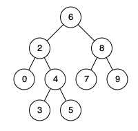

## Task 13：[235. Lowest Common Ancestor of a Binary Search Tree](https://leetcode-cn.com/problems/lowest-common-ancestor-of-a-binary-search-tree/)

### 题目

Given a binary search tree (BST), find the lowest common ancestor (LCA) of two given nodes in the BST.

According to the definition of LCA on Wikipedia: “The lowest common ancestor is defined between two nodes p and q as the lowest node in T that has both p and q as descendants (where we allow a node to be a descendant of itself).”

Given binary search tree:  root = [6,2,8,0,4,7,9,null,null,3,5]



```
Example 1:
Input: root = [6,2,8,0,4,7,9,null,null,3,5], p = 2, q = 8
Output: 6
Explanation: The LCA of nodes 2 and 8 is 6.

Example 2:
Input: root = [6,2,8,0,4,7,9,null,null,3,5], p = 2, q = 4
Output: 2
Explanation: The LCA of nodes 2 and 4 is 2, since a node can be a descendant of itself according to the LCA definition.

Note:
All of the nodes' values will be unique.
p and q are different and both values will exist in the BST.
```

### 思路

1. 利用二叉搜素树根节点大于左子树且小于右子树的性质，用两个栈分别保存从root到p、q的路径上的节点，然后同时出栈，当出栈节点相等时，此结点即为最近的共同祖先节点。此思路存在一个问题，就是两个栈里的节点个数可能是不一样的，这样怎么保证在出栈时候不会错过祖先节点。
2. 利用二叉搜素树根节点大于左子树且小于右子树的性质，对于节点p、q，如果p与q的val同时小于或者大于root，则往下迭代，如果p与q分别小于大于（或大于小于），则当前root即为他们的最近父节点。

思路2的代码如下（自己写）：

```java
class Solution {
    public TreeNode lowestCommonAncestor(TreeNode root, TreeNode p, TreeNode q) {
        if(root == null)
            return null;
        
        while(root != null){
            if(p.val < root.val && q.val < root.val)
                root = root.left;
            else if(p.val > root.val && q.val > root.val)
                root = root.right;
            else 
                return root;    
        }
        return root;
    }
}
```

### 思考

1. 从开始的没有思路到想出有缺陷的思路1，再到正确的解法思路2，用了40分钟左右的时间，这说明只要愿意思考，还是能够想出题解来的。而其中的关键就是一定要从所给定的数据结构的特性出发，此题再次证明了Media难度以下题目的解题思路都是紧贴数据结构的。