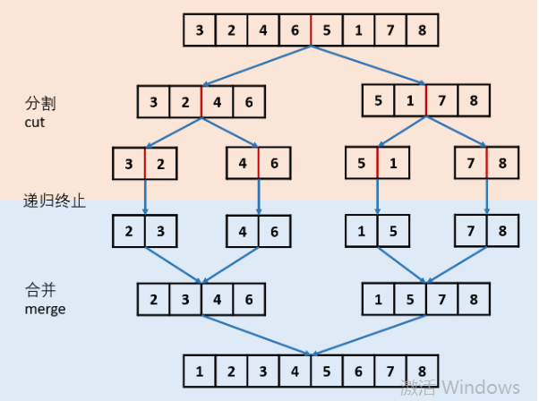

## Task 5：[148. 排序链表](https://leetcode-cn.com/problems/sort-list/)

### 题目

在 O(n log n) 时间复杂度和常数级空间复杂度下，对链表进行排序。

```
示例 1:
输入: 4->2->1->3
输出: 1->2->3->4

示例 2:
输入: -1->5->3->4->0
输出: -1->0->3->4->5
```

### 思路

​		排序问题，首先要认识到对于排序链表和排序数组的区别在于，数组中元素是可以随机访问的，而链表不可以。同时题目要求在O(nlogn)时间复杂度和常数级空间复杂度下排序，常用的时间复杂度为O(nlogn)的排序算法是堆排序、快速排序和归并排序。但是对于快排其中的Partition操作来说，如果操作的对象不是数组，则效率是极低的，因此本题的解法应该是归并排序。算法的话其实和对数组进行归并排序差不多，如下。



**算法：**

1. 遍历链表的长度，让midP指阵指向位于链表中间的节点；
2. 让right = midP.next，即指向右边链表的起始节点，同时让left指向左边链表的起始节点；
3. 分治：分别对left和right指向的链表排序；
4. 返回排序后链表的头结点；

```java
class Solution {
    public ListNode sortList(ListNode head) {
        if(head == null)
            return null;
        if(head.next == null)
            return head;
        
        ListNode left = head; //指向链表左边的起始节点
        ListNode cursor = head; //用于求链表长度的游标
        int len = 0;
        while(cursor!=null){
            len++;
            cursor = cursor.next;
        }
        ListNode midP = head; //用来指向位于链表中间位置的节点
        for(int i=1;i<len/2;i++)
            midP = midP.next;
        ListNode right = midP.next; //指向链表右边的起始节点
        midP.next = null; //让左半边链表链尾指向null
        
        ListNode node1 = sortList(left);
        ListNode node2 = sortList(right);
        ListNode p = mergeList(node1,node2);
        return p;
    }
    
    public ListNode mergeList(ListNode node1,ListNode node2){
        if(node1 == null && node2==null)
            return null;
        if(node1 == null)
            return node2;
        if(node2 == null)
            return node1;
        
        ListNode head = new ListNode(0); //设置一个头结点，便于操作，返回head.next即可。
        head.next = null;
        ListNode p = head;
        
        while(node1!=null && node2!=null){
            if(node1.val <= node2.val){
                p.next = node1;
                p = p.next;
                node1 = node1.next;
            }else{
                p.next = node2;
                p = p.next;
                node2 = node2.next;
            }
        }
        if(node1 != null)
            p.next = node1;
        else
            p.next = node2;
        return head.next;
    }
}
```

### 思考

1. 如果用快速排序怎么做呢？应该可以吧，但是实现过程会比较复杂，下周试试。

