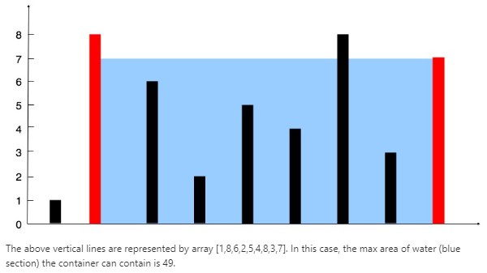

## [11.（Medium） Container With Most Water](https://leetcode-cn.com/problems/container-with-most-water/)

### 题目

Given n non-negative integers a1, a2, ..., an , where each represents a point at coordinate (i, ai). n vertical lines are drawn such that the two endpoints of line i is at (i, ai) and (i, 0). Find two lines, which together with x-axis forms a container, such that the container contains the most water.

**Note:** You may not slant the container and n is at least 2.



**Example:**

```java
Input: [1,8,6,2,5,4,8,3,7]
Output: 49
```

### 思路：

1. **暴力解法**，建一个双重的for循环，枚举每两根线的组合情况，返回最大的那个面积块。

代码如下:

```java
public int maxArea(int[] height) {
    int maxAr = 0;
    for(int i=0;i<height.length-1;i++){
        for(int j=i+1;j<height.length;j++){
            int area = (j-i)*(Math.min(height[j],height[i]));
            maxAr = Math.max(area,maxAr);
        }
    }
    return maxAr;
}
```


**2.双指针法**

本题中求解面积的基本表达式为：area = min(height[left],height[right])*(right-left)，left和right分别为左右边界指针。用res保存最大的面积值，让值小的指针向内移动，因为面积取决于两指针之间的距离与值小的line的乘积，虽然减小了指针间的距离（right-left），但是可能使得矩形的高度增加，从而找到更大的面积。反之，如果向内移动值大的指针，移动后的指针的高不一定增大，重要的是即使是增大了，它的高也取决于小的那一根line，而此时区间长度也减少了，所以面积一定减小。

注：当左右指针指向的高度相等时，left和right同时向内移动，原因见代码中的注释内容。

代码如下：

```java
public int maxArea(int[] height) {  
    if(height.length<=1)
        return -1;
    int left=0,right = height.length-1,res=0;
    while(left < right){
        int current = Math.min(height[left],height[right])*(right-left);
        res = current > res ? current : res;

        if(height[left] < height[right])
            ++left;
        else if(height[left] > height[right])
            --right;
        else{ //height[left]==height[right],此时无论是++left,还是--right，都会使得面积变小，因为长(right-left)变小了，而高不变。所以这里可以直接两个指针都向中间移动，这样才可能找到使得面积变大的两根线。
            ++left;
            --right;
        }
    }
    return res;
}
```


**2.分治法**：这里不能无脑二分！！！！！

把原问题转换为规模更小的子问题，分治的终止条件是right-left==1，即只存在两根相邻的线时。

代码如下，不过未能得到正确的结果，感觉代码是没有问题的。

```java
class Solution {
    public int maxArea(int[] height) {  
        if(height.length == 2)
            return Math.min(height[0],height[1]);
        
        return findMaxArea(height,0,height.length-1);
    }
    
    public int findMaxArea(int[] height,int left,int right){
        if(right-left == 1)
            return Math.min(height[left],height[right]);
        int mid = (left+right)/2;   
        
        int lArea = findMaxArea(height,left,mid);
        int rArea = findMaxArea(height,mid,right);
        
        //[left...mid...right]区间的的最大面积可能在[left...mid]中，也可能在[mid...right]中，也可能是[left...right]
        int m1 = Math.max(lArea,rArea);//保存左部和右部中面积大的那块
        int sectionArea = (right-left)*(Math.min(height[left],height[right]));
        return Math.max(m1,sectionArea);
    }
}
```

### 思考

1. 一开始想到用暴力解法，跑通后开始考虑更优解；想到求解[left,right]的问题可以分解为规模更小但是性质相同的子问题，所以想到了分治法，根据思路写出了分治代码。这种解决问题的思路较之前有了一点进步，就是先解决问题 -> 再考虑更优解。继续培养这种思维。
2. 不过分治代码没有跑通，不知问题出在哪里，还需要继续看看。

