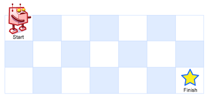

## Task 26：[62. Unique Paths](https://leetcode-cn.com/problems/unique-paths/)

### 题目

A robot is located at the top-left corner of a m x n grid (marked 'Start' in the diagram below).

The robot can only move either down or right at any point in time. The robot is trying to reach the bottom-right corner of the grid (marked 'Finish' in the diagram below).

How many possible unique paths are there?



​                                   Above is a 7 x 3 grid. How many possible unique paths are there?

Note: m and n will be at most 100.

**Example 1:**

> Input: m = 3, n = 2
> Output: 3
> Explanation:
> From the top-left corner, there are a total of 3 ways to reach the bottom-right corner:
>
> 1. Right -> Right -> Down
> 2. Right -> Down -> Right
> 3. Down -> Right -> Right
>

### 思路

https://leetcode-cn.com/problems/unique-paths/solution/xiao-xue-ti-java-by-biyu_leetcode/

代码

```java
class Solution {
    public int uniquePaths(int m, int n) {
        int[] memo = new int[n];

        Arrays.fill(memo, 1);

        for (int i = 1; i < m; i++) {
            for (int j = 1; j < n; j++) {
                memo[j] += memo[j - 1];
            }
        }

        return memo[n - 1];
    }
}

```


### 思考

一道动态规划的题目，还没有系统复习这块儿，题目都不会做，需要好好复习下才行。


