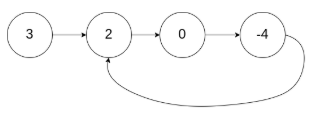

## Task 34：[141. Linked List Cycle](https://leetcode-cn.com/problems/linked-list-cycle/)

### 题目

Given a linked list, determine if it has a cycle in it.

To represent a cycle in the given linked list, we use an integer pos which represents the position (0-indexed) in the linked list where tail connects to. If pos is -1, then there is no cycle in the linked list.

**Example 1:**

> Input: head = [3,2,0,-4], pos = 1
> Output: true
> Explanation: There is a cycle in the linked list, where tail connects to the second node.



### 思路

法1：遍历链表，同时用hash表保存每个节点的引用(地址)，当指针p指向一个节点时，判断hash表中是否存在指向其引用，如果有则存在环，当p的指向为空时表示遍历到了链尾，即无环

代码如下：

```

```


法2：设置快慢指针，slow一次走一个节点，fast一次走两个节点，如果有环，则fast一定会追上slow即相遇，还没怎么弄明白为什么一定相遇，需要继续看看。

代码如下：

```java
public class Solution {
    public boolean hasCycle(ListNode head) {
        if(head==null || head.next==null)
            return false;
        ListNode slow = head;
        ListNode fast = head.next;
        while(slow != fast){
            if(fast==null || fast.next==null)
                return false;
            slow = slow.next;
            fast = fast.next.next;
        }
        
        return true;
    } 
}
```

### 思考

这里的快慢指针法完全无法想到，所以需要多看题解，拓宽知识面。