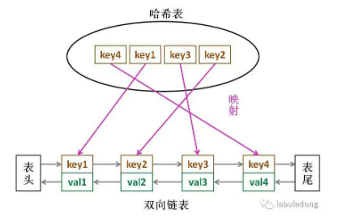

## task 15（M）： [146. LRU Cache](https://leetcode-cn.com/problems/lru-cache/)

### 题目

Design and implement a data structure for Least Recently Used (LRU) cache. It should support the following operations: get and put.

get(key) - Get the value (will always be positive) of the key if the key exists in the cache, otherwise return -1.
put(key, value) - Set or insert the value if the key is not already present. When the cache reached its capacity, it should invalidate the least recently used item before inserting a new item.

The cache is initialized with a positive capacity.

##### Follow up:

> Could you do both operations in O(1) time complexity?

##### Example:

> LRUCache cache = new LRUCache( 2 /* capacity */ );
>
> cache.put(1, 1);
> cache.put(2, 2);
> cache.get(1);       // returns 1
> cache.put(3, 3);    // evicts key 2
> cache.get(2);       // returns -1 (not found)
> cache.put(4, 4);    // evicts key 1
> cache.get(1);       // returns -1 (not found)
> cache.get(3);       // returns 3
> cache.get(4);       // returns 4

### 思路

1. 根据题意，要让put和get方法的时间复杂度为O(1)，则此Cache数据结构必要的条件：查询快，插入快，删除快，有顺序之分。
2. 且cache必须有顺序之分，以区分最近使用和久未使用的数据；而且我们要在cache中查找键是否存在；如果容量满了要删除最后一个数据；每次访问还要把数据插入到队头。
3. 如果采用hash表，查找快，但是数据无序；链表有顺序之分，插入删除快，但是插入慢，所以结合这二者形成一种新的数据结构：哈希链表，如下图所示：



注：

1. 为什么要用双向链表，因为删除一个节点除了要得到该节点本身的指针外，还需要得到其前驱节点的指针，双向链表满足条件，保证操作为O(1)。
2. 为什么在双向链表中要存储key和val，而不仅仅是val，这是因为当缓存已满删除掉双向链表中的最后一个节点后，还需要删除掉map中的<key,node>对应关系，因为双向链表保存了key和val，所以可以根据val得到node的key，便于map删除。
3. 在进行put操作时，对于已经存在的(key,node)，为什么是建立新节点插入到链首，而不是从链表中将已经存在的node移动到头结点呢？这是为了统一put操作，编码方便。

#### 代码如下：

一共包含3个类，定义链表节点的Node，定义双向链表的DoubleList，以及LRUCache。

##### （1）Node类与DoubleList

```java
/*定义双链表节点
 * */
class Node{
	public int key,val;
	public Node next,prev;
	public Node(int k,int v) {
		this.key = k;
		this.val = v;
	}
}

/*构建一个双链表，实现几个需要的API
 * */
class DoubleList{
	private Node head,tail; //头尾虚节点
	private int size; //链表元素数
	
	public DoubleList() {
		head = new Node(0,0);
		tail = new Node(0,0);
		head.next = tail;
		tail.prev = head;
	}
	
	//在链表头部添加节点x
	public void addFirst(Node x) {
		x.next = head.next;
		x.prev = head;
		head.next.prev = x;
		head.next = x;
		size++;
	}
	
	//删除链表中的x节点（x一定存在）
	public void remove(Node x) {
		x.prev.next = x.next;
		x.next.prev = x.prev;
		size--;
	}
	
	//删除链表中最后一个节点，并返回该节点
	public Node removeLast() {
		if(tail.prev == head)
			return null;
		Node last = tail.prev;
		remove(last);
		return last;
	}
	
	//返回链表长度
	public int size() {
		return size;
	}
}
```

LRUCache类：

```java
import java.util.HashMap;

public class LRUCache {
	//key -> Node(key,val)
	private HashMap<Integer,Node> map;
	//Node(k1,v1) -> Node(k2,v2)
	private DoubleList cache;
	//最大容量
	private int cap;
	
	//初始化双向链表
	public LRUCache(int capacity) {
		this.cap = capacity;
		map = new HashMap<>();
		cache = new DoubleList();
	}
	
	public int get(int key) {
		if(!map.containsKey(key))
			return -1;
		int val = map.get(key).val; //返回key对应的val
		//利用put方法把该数据提前
		put(key,val);
		return val;
	}
	
	public void put(int key,int val) {
		//new一个新节点
		Node x = new Node(key,val);
		if(map.containsKey(key)) {
			//删除旧节点，新的插入到头部
			cache.remove(map.get(key));
			cache.addFirst(x);
			//更新map中对应的数据,很关键
			map.put(key, x);
		}else {
			if(cap == cache.size()) {
				//删除链表最后一个节点
				Node last = cache.removeLast();
				//删除map中的记录
				map.remove(last.key);
			}
			//直接添加到头部
			cache.addFirst(x);
			map.put(key, x);
		}
	}
    
    /*-----------测试------------------*/
    public static void main(String[] args) {
        LRUCache cache = new LRUCache(2);
        cache.put(1, 1);
        cache.put(2, 2);
        System.out.println(cache.get(1));
        cache.put(3, 3);
        System.out.println(cache.get(2));
    }
}
```

### 思考

1.Hash表竟然能和双向链表结合得如此之好，以及在LinkedHashMap中的应用，这些都是之前没有了解到的。需要看看Java中这些容器的实现。